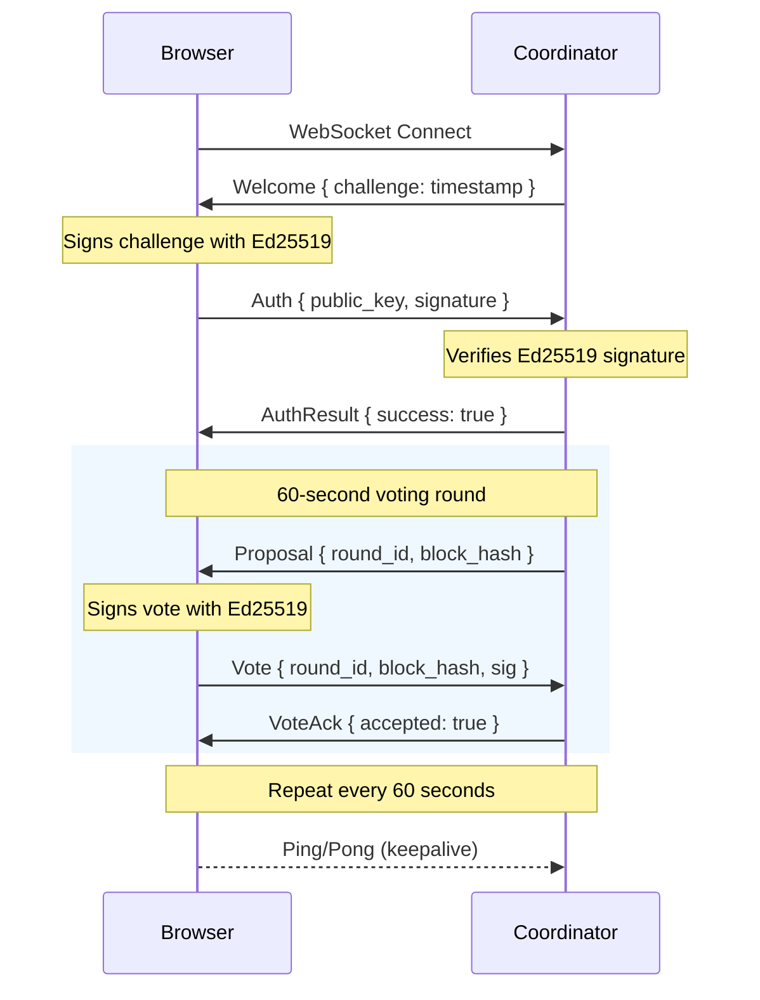

# Browser Validator Architecture

> **Zero-Knowledge Validation: Keys Never Leave the User's Device**

This document describes SELF Chain's browser-based validator architecture, a key innovation that enables true decentralization while preserving user sovereignty.

---

## Executive Summary

SELF Chain validators run **in the user's browser**, not on hosted servers. This architectural decision preserves **zero-knowledge principles** — validator signing keys never leave the user's device.

**Key Innovation:** Instead of delegating keys to servers, we delegate **time**. Users validate when they're online (app is open). The blockchain only needs *some* validators online at any time.

---

## Architecture Overview

```
┌─────────────────────────────────────────────────────────────────────────────┐
│                              USER'S BROWSER                                  │
│                                                                              │
│  ┌────────────────────────────────────────────────────────────────────────┐ │
│  │                        Recovery Phrase (12 words)                       │ │
│  │                        Never transmitted to server                       │ │
│  └──────────────────────────────────┬─────────────────────────────────────┘ │
│                                      │                                       │
│                                      ▼                                       │
│                           ┌─────────────────────┐                           │
│                           │    BIP39 Seed       │                           │
│                           │    (64 bytes)       │                           │
│                           └──────────┬──────────┘                           │
│                                      │                                       │
│               ┌──────────────────────┼──────────────────────┐               │
│               │                      │                      │               │
│               ▼                      ▼                      ▼               │
│     ┌─────────────────┐   ┌─────────────────┐   ┌─────────────────┐        │
│     │ m/44'/60'/0'/0/0│   │ m/44'/60'/0'/0/1│   │ m/44'/60'/1'/0/0│        │
│     │                 │   │                 │   │                 │        │
│     │   Wallet Key    │   │ Messaging Keys  │   │ Validator Key   │        │
│     │   (secp256k1)   │   │   (Ed25519)     │   │   (Ed25519)     │        │
│     └─────────────────┘   └─────────────────┘   └────────┬────────┘        │
│                                                          │                  │
│                                               Held in memory only           │
│                                               Signs votes client-side       │
│                                                          │                  │
└──────────────────────────────────────────────────────────┼──────────────────┘
                                                           │
                                                    WebSocket (WSS)
                                                           │
                                                           ▼
┌──────────────────────────────────────────────────────────────────────────────┐
│                              COORDINATOR                                      │
│                                                                               │
│  ┌─────────────────────────────────────────────────────────────────────────┐ │
│  │                        WebSocket Handler                                 │ │
│  │                                                                          │ │
│  │  • Accepts connections from browser validators                          │ │
│  │  • Sends challenge for Ed25519 authentication                          │ │
│  │  • Verifies signatures on all messages                                  │ │
│  │  • Broadcasts proposals to authenticated validators                     │ │
│  │  • Receives and records signed votes                                    │ │
│  │  • Tracks connection time for reward mechanisms                        │ │
│  │                                                                          │ │
│  └─────────────────────────────────────────────────────────────────────────┘ │
│                                      │                                        │
│                                      ▼                                        │
│  ┌─────────────────────────────────────────────────────────────────────────┐ │
│  │                        Consensus Engine                                  │ │
│  │                                                                          │ │
│  │  • 60-second voting rounds                                              │ │
│  │  • 50s proposal collection → 10s voting window                          │ │
│  │  • Most votes for best efficiency wins                                  │ │
│  │  • 2/3+ quorum for finalization                                         │ │
│  │                                                                          │ │
│  └─────────────────────────────────────────────────────────────────────────┘ │
│                                                                               │
└───────────────────────────────────────────────────────────────────────────────┘
```

---

## Why Browser-Based Validators?

### The Problem with Key Delegation

Traditional staking chains (Cosmos, Ethereum 2.0) use **key delegation**:

```
❌ TRADITIONAL MODEL:
User → Gives signing key to operator → Operator runs 24/7 → User trusts operator
```

**Problems:**
1. Operator has user's private key (trust required)
2. Centralization risk (few large operators)
3. Violation of zero-knowledge principles

### The SELF Chain Solution

Instead of delegating **keys**, we delegate **time**:

```
✅ SELF CHAIN MODEL:
User opens app → Browser connects to coordinator → Browser signs votes → User closes app
```

**Benefits:**
- ✅ **Zero-knowledge preserved** — keys never leave browser
- ✅ **True decentralization** — no trusted validator operators
- ✅ **User custody** — users control their own keys
- ✅ **Simple incentives** — more time online = more participation

### Trade-offs

| Aspect | Browser Validators | Hosted Validators |
|--------|-------------------|-------------------|
| Key custody | ✅ User keeps key | ❌ Operator has key |
| 24/7 uptime | ❌ Only when app open | ✅ Always running |
| Participation | Variable (user-driven) | Consistent |
| Trust model | ✅ Zero-knowledge | Requires trust |
| Infrastructure | None (browser) | Servers required |

**SELF Chain's Choice:** We prioritize zero-knowledge over 24/7 uptime. The chain only needs *some* validators online at any time.

---

## Key Derivation

### BIP32 Path Structure

All keys derive from the same recovery phrase:

| Purpose | BIP32 Path | Algorithm | Notes |
|---------|------------|-----------|-------|
| Wallet (EVM) | `m/44'/60'/0'/0/0` | secp256k1 | EVM-compatible |
| Messaging (encryption) | `m/44'/60'/0'/0/1` | X25519 | E2E encryption |
| Messaging (signing) | `m/44'/60'/0'/0/1` | Ed25519 | Message signatures |
| **Validator** | `m/44'/60'/1'/0/0` | **Ed25519** | Block voting |

### Why Account 1 for Validators?

BIP44 structure: `m/purpose'/coin_type'/account'/change/address_index`

Using **Account 1** (`/1'/`) provides semantic separation:
- **Account 0** = Wallet and messaging (existing)
- **Account 1** = Blockchain validation (separate domain)

### Derivation Code

```typescript
const VALIDATOR_DERIVATION_PATH = "m/44'/60'/1'/0/0";

export function deriveValidatorKeysFromSeed(seed: Uint8Array): ValidatorKeyPair {
  const hdkey = HDKey.fromMasterSeed(seed);
  const derived = hdkey.derive(VALIDATOR_DERIVATION_PATH);
  const validatorSeed = sha256(derived.privateKey);
  const keypair = nacl.sign.keyPair.fromSeed(validatorSeed);
  
  return {
    publicKey: keypair.publicKey,           // 32 bytes
    privateKey: keypair.secretKey.slice(0, 32),
    publicKeyBase64: encodeBase64(keypair.publicKey),
  };
}
```

---

## WebSocket Protocol

### Connection Flow



### Message Types

#### Client → Server

```typescript
// Authentication (after receiving Welcome)
{
  "type": "auth",
  "public_key": "base64-encoded-32-bytes",
  "challenge": 1704067200,
  "signature": "base64-encoded-64-bytes",
  "user_id": "uuid-from-application"  // Maps public_key to user account
}

// Vote on proposal
{
  "type": "vote",
  "round_id": 42,
  "block_hash": "hex-encoded-block-hash",
  "approve": true,
  "signature": "base64-encoded-64-bytes"
}

// Keepalive
{
  "type": "ping"
}
```

#### Server → Client

```typescript
// Welcome (sent immediately on connect)
{
  "type": "welcome",
  "challenge": 1704067200,
  "version": "1.0.0"
}

// Authentication result
{
  "type": "auth_result",
  "success": true,
  "error": null
}

// Proposal to vote on
{
  "type": "proposal",
  "round_id": 42,
  "block_hash": "hex-encoded-block-hash",
  "builder_id": "builder-xyz",
  "efficiency": 9500,
  "deadline_ms": 10000,
  "total_proposals": 3
}

// Vote acknowledgement
{
  "type": "vote_ack",
  "round_id": 42,
  "accepted": true,
  "error": null
}

// Round result
{
  "type": "round_result",
  "round_id": 42,
  "winner": "hex-encoded-winning-hash",
  "total_votes": 45,
  "your_vote_counted": true
}

// Keepalive response
{
  "type": "pong",
  "timestamp": 1704067260
}

// Error
{
  "type": "error",
  "code": "NOT_AUTHENTICATED",
  "message": "Must authenticate before voting"
}
```

---

## Signature Formats

All signatures use **Ed25519** over UTF-8 encoded messages.

### Authentication Signature

```
Message: "self-chain-auth:{challenge}"
Example: "self-chain-auth:1704067200"

Sign with: Validator private key (32 bytes)
Result:    64-byte Ed25519 signature, base64 encoded
```

### Vote Signature

```
Message: "self-chain-vote:{round_id}:{block_hash}:{approve}"
Example: "self-chain-vote:42:abc123def456:true"

Sign with: Validator private key (32 bytes)
Result:    64-byte Ed25519 signature, base64 encoded
```

### Signature Verification (Rust)

```rust
use ed25519_dalek::{VerifyingKey, Signature};
use base64::{Engine, engine::general_purpose::STANDARD as BASE64};

pub fn verify_signature(
    public_key_base64: &str,
    message: &[u8],
    signature_base64: &str,
) -> Result<bool> {
    let public_key_bytes = BASE64.decode(public_key_base64)?;
    let verifying_key = VerifyingKey::from_bytes(&public_key_bytes.try_into()?)?;
    
    let signature_bytes = BASE64.decode(signature_base64)?;
    let signature = Signature::from_bytes(&signature_bytes.try_into()?);
    
    match verifying_key.verify(message, &signature) {
        Ok(()) => Ok(true),
        Err(_) => Ok(false),
    }
}
```

---

## Consensus Model

### Round Timing

| Phase | Duration | Activity |
|-------|----------|----------|
| Proposal collection | 50 seconds | Block builders submit proposals |
| Voting | 8 seconds | Validators vote on best proposal |
| Finalization | 2 seconds | Commit signatures collected |
| **Total round** | **60 seconds** | |

### Vote Threshold

- **Quorum required:** 2/3 of participating validators
- **Winner selection:** Block with most votes for highest efficiency
- **Tiebreaker:** Lowest proposer ID (deterministic)

### Fault Tolerance

| Scenario | Outcome |
|----------|---------|
| Validator offline | Just doesn't participate (no penalty) |
| Validator votes late | Vote ignored (deadline passed) |
| Insufficient quorum | Round extends or uses fallback |
| Network partition | Each partition votes independently |

---

## Security Considerations

### Key Security

- **Private keys never transmitted** — all signing happens in browser
- **Challenge-response authentication** — prevents replay attacks
- **Per-message signatures** — each vote is independently verifiable
- **No session tokens** — public key is the identity

### Attack Mitigations

| Attack | Mitigation |
|--------|------------|
| Replay attack | Challenge includes timestamp, expires after auth |
| Man-in-the-middle | WSS (TLS) encryption |
| Fake coordinator | Certificate pinning (optional) |
| Vote flooding | Rate limiting per public key |
| Sybil attack | One validator key per recovery phrase + bonds |

### Trust Model

```
What the coordinator CAN do:
- See validator public keys
- See how validators vote
- Track connection times

What the coordinator CANNOT do:
- Access user funds
- Sign votes without user's browser
- Recover user's private key
- Move assets (separate key derivation path)
```

---

## Integration for Constellations

### Your Application ↔ Validator Flow

```
1. User opens your app (e.g., https://your-constellation.com)
2. User logs in (recovery phrase → master seed)
3. App derives validator keypair client-side (BIP32 m/44'/60'/1'/0/0)
4. App connects WebSocket to coordinator
5. Coordinator sends authentication challenge (random nonce)
6. App signs challenge with validator key (Ed25519)
7. Coordinator verifies signature → authenticated
8. Coordinator broadcasts proposals every 60 seconds
9. App automatically signs and submits votes for each proposal
10. Coordinator tracks participation time (for your reward mechanism)
11. When user closes app, WebSocket disconnects (keys cleared from memory)
```

### SDK Integration

```typescript
import { ValidatorClient } from '@self-chain/validator-sdk';

const client = new ValidatorClient({
  coordinatorUrl: 'wss://coordinator.your-constellation.com/ws/validator',
  seed: userSeed,  // From recovery phrase
  userId: user.id,
});

// Connect and start validating
await client.connect();

// Events
client.on('connected', () => console.log('Validating!'));
client.on('vote_accepted', (round) => console.log(`Voted in round ${round}`));
client.on('round_result', (result) => console.log(`Winner: ${result.winner}`));

// Disconnect when done
client.disconnect();
```

---

## Why Not Hosted Validators?

### Traditional Approach (Rejected)

```
User → PWA Backend (stores delegated keys) → Orchestrator → Hosted Validators
```

**Problems:**
1. **Violates zero-knowledge** — server would have user private keys
2. **Centralization risk** — single encryption secret for all keys
3. **User loses custody** — validator key controlled by operator, not user
4. **Unnecessary complexity** — validators can sign client-side when online

### Browser Approach (Implemented)

```
User's Browser (holds keys) → WebSocket → Coordinator (no keys, just verifies)
```

**Benefits:**
- Keys never leave user's browser (zero-knowledge preserved)
- User retains full custody
- True decentralization
- Simpler architecture (no key management infrastructure)

---

## Scaling Economics

Browser-based validators invert the traditional cost model:

```
Traditional PoS:                    PoAI:
┌─────────────────────┐            ┌─────────────────────┐
│  You run servers    │            │  Users hold keys    │
│  for validators     │            │  in their browser   │
│  ($5-50/month each) │            │  and sign locally   │
└─────────────────────┘            └─────────────────────┘
        ↓                                   ↓
  Your costs scale                  No per-user servers
  with users                        Fixed coordination layer
```

**Coordination layer costs (reference):**

| Validators | Infrastructure | Est. Cost/Month |
|------------|----------------|-----------------|
| 1,000 | 1 coordinator | ~$50 |
| 10,000 | 1 coordinator | ~$100 |
| 100,000 | 2 coordinators + LB | ~$300 |
| 1,000,000 | 3 coordinators + LB | ~$1,000 |

**Scales to millions with fixed infrastructure costs.**

---

*Zero-knowledge blockchain validation. Your keys, your browser, your sovereignty.* 🔐
