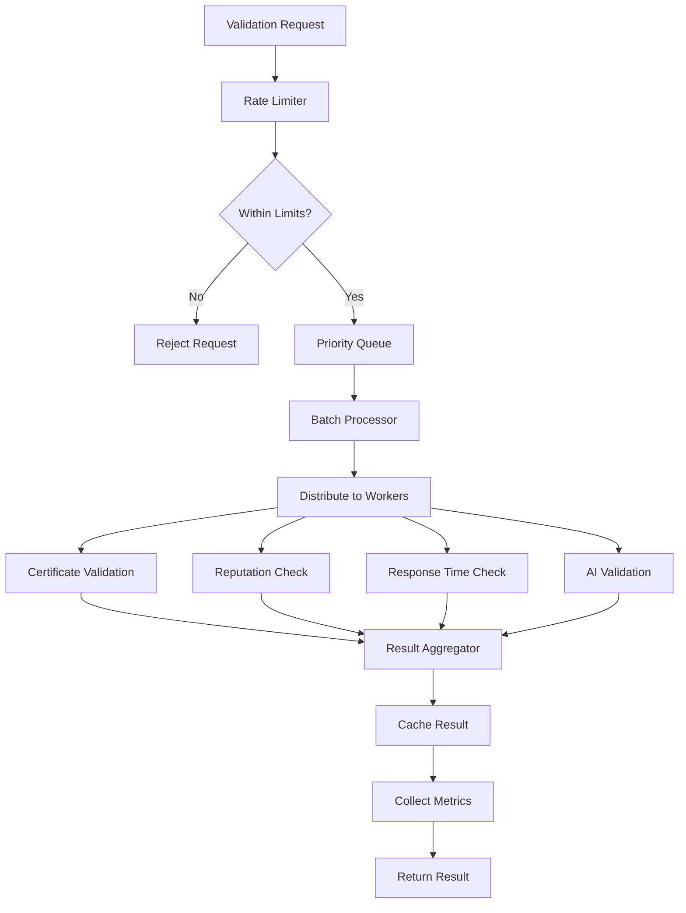

# SELF Chain Network Architecture

> This document describes the network layer and peer validation system for SELF Chain constellations.

---

## Table of Contents

1. [Overview](#overview)
2. [Peer Validation System](#peer-validation-system)
3. [Validation Workers](#validation-workers)
4. [Health Monitoring](#health-monitoring)
5. [Validation Flow](#validation-flow)
6. [Integration Points](#integration-points)
7. [Configuration](#configuration)
8. [Metrics](#metrics)

---

## Overview

SELF Chain implements a cloud-native, distributed network architecture where:

- All validation processing occurs in the cloud
- No local processing required on user devices
- Distributed across multiple nodes for resilience
- AI-powered validation for enhanced security

### Key Principles

1. **Cloud-First**: Validation workers run in the cloud, not on user devices
2. **Distributed**: No single point of failure
3. **AI-Enhanced**: Pattern analysis improves over time
4. **Reputation-Aware**: Historical behavior influences trust

---

## Peer Validation System

The Peer Validation System ensures the integrity, security, and reliability of peer interactions within the network. It implements sophisticated validation using AI, reputation scoring, and distributed consensus.

### Architecture Overview

```
┌─────────────────────────────────────────────────────────────────┐
│                   Peer Validation System                        │
├─────────────────────────────────────────────────────────────────┤
│  ┌─────────────┐  ┌─────────────┐  ┌─────────────┐             │
│  │Rate Limiter │→ │Priority     │→ │Batch        │             │
│  │             │  │Queue        │  │Processor    │             │
│  └─────────────┘  └─────────────┘  └─────────────┘             │
│                          ↓                                      │
│  ┌─────────────────────────────────────────────────────────┐   │
│  │              Validation Workers                          │   │
│  │  ┌─────────┐ ┌─────────┐ ┌─────────┐ ┌─────────┐        │   │
│  │  │ Cert    │ │Reputation│ │Response │ │  AI     │        │   │
│  │  │Validator│ │ Worker  │ │Time Work│ │ Worker  │        │   │
│  │  └─────────┘ └─────────┘ └─────────┘ └─────────┘        │   │
│  └─────────────────────────────────────────────────────────┘   │
│                          ↓                                      │
│  ┌─────────────┐  ┌─────────────┐  ┌─────────────┐             │
│  │Result      │→ │Cache        │→ │Metrics      │             │
│  │Aggregator  │  │             │  │Collector    │             │
│  └─────────────┘  └─────────────┘  └─────────────┘             │
└─────────────────────────────────────────────────────────────────┘
```

---

## Validation Workers

Validation workers are specialized cloud processes that handle specific validation tasks:

### Worker Types

| Worker | Responsibility |
|--------|---------------|
| **Certificate Validator** | Validates peer certificates and cryptographic signatures |
| **Reputation Worker** | Calculates reputation scores from historical behavior |
| **Response Time Worker** | Measures peer response times for performance evaluation |
| **AI Validation Worker** | Performs AI-assisted validation using pattern analysis |
| **Batch Processing Worker** | Handles batch validation for efficiency |

### Worker Distribution

Workers are distributed across cloud regions for:
- Geographic redundancy
- Lower latency to peers
- Fault tolerance
- Load distribution

---

## Health Monitoring

The Validation Worker Monitor tracks health and performance of all workers.

### Health Score Calculation

The overall health score combines multiple factors:

| Factor | Weight | Description |
|--------|--------|-------------|
| Success Rate | 40% | Percentage of successful validations |
| Error Rate | 30% | Inverse of error frequency |
| Latency | 20% | Response time performance |
| AI Validation Score | 10% | AI model confidence |
| Reputation Score | 10% | Historical reliability |

### Status Levels

| Status | Health Score | Action |
|--------|-------------|--------|
| **Healthy** | ≥ 0.8 | Normal operation |
| **Warning** | 0.7 - 0.79 | Monitor closely |
| **Unhealthy** | < 0.7 | Reduce load, investigate |
| **Offline** | No heartbeat | Remove from rotation |

---

## Validation Flow

The validation process follows these ordered steps:



### Step Details

1. **Rate Limiting**: Prevents abuse and DoS attacks
2. **Priority Queue**: Prioritizes tasks based on urgency and peer reputation
3. **Batch Processing**: Groups similar validations for efficiency
4. **AI Validation**: Uses pattern analysis for anomaly detection
5. **Reputation Scoring**: Incorporates historical peer behavior
6. **Result Aggregation**: Combines worker outputs into final decision
7. **Caching**: Stores results to avoid redundant validation
8. **Metrics Collection**: Tracks performance for monitoring

---

## Integration Points

The validation system integrates with several SELF Chain components:

| Component | Integration Type | Purpose |
|-----------|-----------------|---------|
| **OrbitDB** | Storage | Distributed storage of validation results |
| **Libp2p** | Transport | Peer-to-peer communication |
| **AI Services** | Validation | AI-assisted pattern analysis |
| **Load Balancer** | Distribution | Distributing validation tasks |
| **Metrics System** | Observability | Monitoring and alerting |
| **Consensus Layer** | Finality | Validation results inform consensus |

---

## Configuration

### Configurable Parameters

| Parameter | Description | Default |
|-----------|-------------|---------|
| `worker_count_min` | Minimum active workers | 3 |
| `worker_count_max` | Maximum active workers | 100 |
| `health_threshold_warning` | Warning threshold | 0.7 |
| `health_threshold_unhealthy` | Unhealthy threshold | 0.5 |
| `priority_high_threshold` | High priority threshold | 0.9 |
| `timeout_validation_ms` | Validation timeout | 5000 |
| `retry_max_attempts` | Maximum retry attempts | 3 |
| `batch_size_max` | Maximum batch size | 100 |

### AI Validation Parameters

| Parameter | Description |
|-----------|-------------|
| `pattern_confidence_threshold` | Minimum confidence for AI decisions |
| `anomaly_detection_sensitivity` | Sensitivity of anomaly detection |
| `learning_rate` | Rate of model updates |

---

## Metrics

### Validation Metrics

| Metric | Type | Description |
|--------|------|-------------|
| `validation_requests_total` | Counter | Total validation requests |
| `validation_success_rate` | Gauge | Current success rate |
| `validation_latency_ms` | Histogram | Validation latency distribution |
| `validation_errors_by_type` | Counter | Errors categorized by type |

### Worker Metrics

| Metric | Type | Description |
|--------|------|-------------|
| `worker_health_score` | Gauge | Health score per worker |
| `worker_tasks_processed` | Counter | Tasks processed per worker |
| `worker_error_rate` | Gauge | Error rate per worker |
| `worker_latency_avg` | Gauge | Average latency per worker |

### Resource Metrics

| Metric | Type | Description |
|--------|------|-------------|
| `cache_hit_rate` | Gauge | Cache effectiveness |
| `queue_depth` | Gauge | Pending validations |
| `batch_size_avg` | Gauge | Average batch size |

---

## Security Features

### Rate Limiting

Prevents abuse through:
- Per-peer request limits
- Global request limits
- Adaptive rate adjustment based on load

### Certificate Authentication

All peers must present valid certificates:
- Ed25519 signature verification
- Certificate chain validation
- Expiration checking

### AI-Powered Anomaly Detection

The AI validation worker detects:
- Unusual request patterns
- Suspicious timing characteristics
- Behavioral anomalies

### Reputation-Based Trust

Historical behavior influences:
- Validation priority
- Rate limit allowances
- Consensus weight (for validators)

---

## Error Handling

### Error Categories

| Category | Examples | Recovery |
|----------|----------|----------|
| **Transient** | Network timeout, temporary overload | Automatic retry |
| **Permanent** | Invalid certificate, banned peer | Reject and log |
| **System** | Worker crash, storage failure | Circuit breaker, failover |

### Circuit Breaker Pattern

When error rate exceeds threshold:
1. Worker marked as unhealthy
2. Traffic redirected to healthy workers
3. Automatic recovery attempts
4. Manual intervention if recovery fails

---

## References

- [POAI_SPECIFICATION.md](./POAI_SPECIFICATION.md) - Consensus specification
- [BROWSER_VALIDATOR_ARCHITECTURE.md](./BROWSER_VALIDATOR_ARCHITECTURE.md) - Browser validator details
- [CONSTELLATION_OVERVIEW.md](./CONSTELLATION_OVERVIEW.md) - Constellation model

---

*© 2026 SELF Technology Ltd.*
