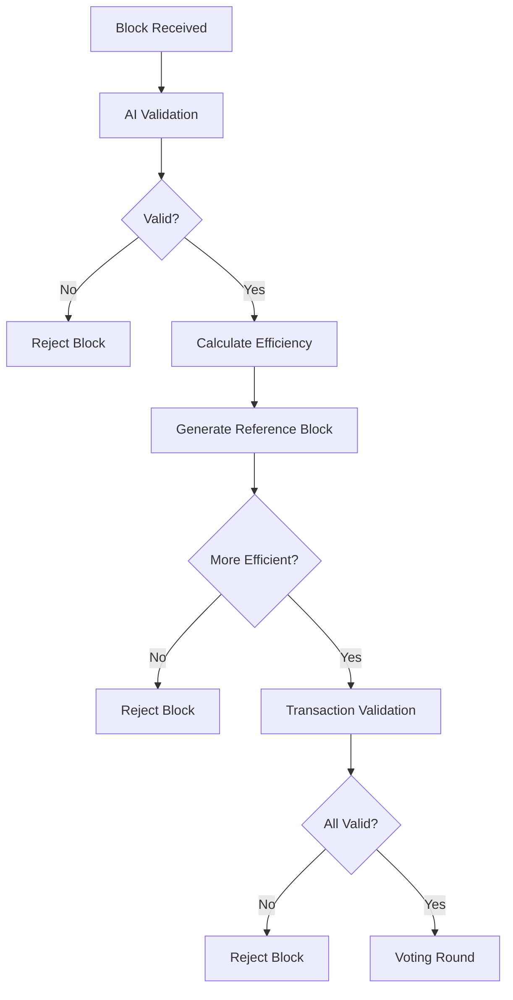
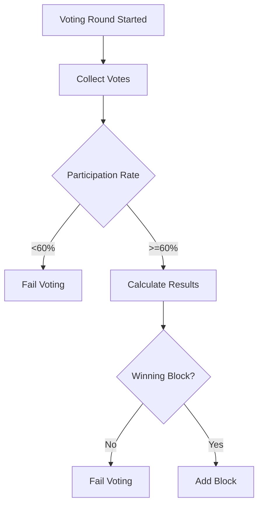

# Proof-of-AI (PoAI) Consensus Specification

> **Source:** This specification is derived from the official PoAI whitepaper at [proofofai.com](https://proofofai.com).
>
> **Implementation:** This repository contains working implementations of core PoAI mechanisms. See `src/consensus/` and `src/blockchain/v1/` for details.

---

## Table of Contents

1. [Overview](#overview)
2. [Protocol Constants](#protocol-constants)
3. [Wire Formats](#wire-formats)
4. [PoAI Competition Model](#poai-competition-model)
5. [Transaction Selection (20/20/50/10)](#transaction-selection-202050-10)
6. [Color Marker Validation](#color-marker-validation)
7. [Deterministic Rules](#deterministic-rules)
8. [State Machine](#state-machine)
9. [Constellation Asset Model](#constellation-asset-model)
10. [Error Handling](#error-handling)
11. [Security Considerations](#security-considerations)
12. [Monitoring Metrics](#monitoring-metrics)
13. [Implementation Notes](#implementation-notes)

---

## Overview

Proof-of-AI (PoAI) is a patent-pending consensus mechanism that replaces computational waste (PoW) and wealth concentration (PoS) with efficient, democratic validation.

### Key Principles

1. **Permissionless verification**: Any party can run a full node and independently verify the chain
2. **Universal full node capability**: Every user can run a fully validating node with minimal storage
3. **Deterministic validity**: Block validity depends only on block contents + previous chain state
4. **No central dependencies**: Consensus does not require central services (AI is optional/advisory)
5. **Constellation-agnostic**: Core consensus rules are independent of constellation-specific features

### The Three Algorithms

PoAI is based on three algorithms that work independently to achieve consensus:

| Algorithm | Role | Implementation |
|-----------|------|----------------|
| **AI-Block Builder** | Forms efficient blocks using 20/20/50/10 transaction selection | `src/consensus/transaction_selector.rs` |
| **Voting Algorithm** | Organizes voting rounds; cannot influence results | `src/consensus/voting.rs` |
| **AI-Validator** | Votes on blocks, validates color markers | `src/consensus/validator.rs` |

---

## Protocol Constants

### Chain Parameters

| Parameter | Value | Description |
|-----------|-------|-------------|
| `CHAIN_ID` | Constellation-specific | Unique chain identifier for replay protection |
| `GENESIS_HEIGHT` | `0` | Height of genesis block |
| `BLOCK_TIME_TARGET` | `60` seconds | Target time between blocks |
| `MAX_BLOCK_SIZE` | `1,000,000` bytes | Maximum block size (1 MB) |
| `MAX_TX_PER_BLOCK` | `1000` | Maximum transactions per block |
| `MAX_TX_SIZE` | `10,000` bytes | Maximum transaction size |

### Consensus Parameters

| Parameter | Value | Description |
|-----------|-------|-------------|
| `QUORUM_THRESHOLD` | `2/3` | Fraction of votes required for commit |
| `TIMEOUT_PROPOSE` | `50` seconds | Window for builders to submit proposals |
| `TIMEOUT_VOTE` | `8` seconds | Window for validators to vote |
| `TIMEOUT_FINALIZE` | `2` seconds | Window for finalization |
| `CLOCK_DRIFT_TOLERANCE` | `5` seconds | Maximum allowed timestamp skew |

### Transaction Selection (20/20/50/10)

| Category | Percentage | Description |
|----------|------------|-------------|
| High Price | 20% | Transactions with highest PointPrice |
| Low Price | 20% | Transactions with lowest PointPrice |
| Average Price | 50% | Transactions with average PointPrice |
| Oldest | 10% | Oldest transactions by timestamp |

---

## Wire Formats

### Canonical Serialization

All protocol messages use **bincode** serialization with deterministic field ordering. This ensures:
- Identical messages produce identical byte sequences
- Hash calculations are reproducible
- Signature verification is unambiguous

### Domain Separation for Signatures

Each message type has a unique prefix for signature domain separation:

```
"self-chain-block-header-v1"
"self-chain-transaction-v1"
"self-chain-vote-prevote-v1"
"self-chain-vote-precommit-v1"
"self-chain-proposal-v1"
```

### Block Header Format

```rust
pub struct BlockHeader {
    // Chain linkage
    pub height: u64,                    // Block height (0 = genesis)
    pub previous_hash: [u8; 32],        // SHA-256 hash of previous block header
    pub timestamp: u64,                 // Unix timestamp (seconds)
    
    // State commitment
    pub state_root: [u8; 32],           // Sparse Merkle Tree root of account state
    pub transactions_root: [u8; 32],    // Merkle root of transactions in block
    
    // Consensus metadata
    pub proposer_id: String,            // Builder ID who proposed this block
    pub round: u64,                     // Consensus round number
    pub chain_id: String,               // Chain identifier (replay protection)
    
    // PoAI-specific
    pub efficiency_score: u64,          // Deterministic efficiency score
    pub point_price: u64,               // PointPrice for this block
    
    // Finality proof
    pub commit_signatures: Vec<CommitSignature>, // 2/3+ validator signatures
}
```

**Block Hash Calculation:**
```rust
fn calculate_block_hash(header: &BlockHeader) -> [u8; 32] {
    let prefix = b"self-chain-block-header-v1";
    let encoded = bincode::serialize(header).unwrap();
    let mut hasher = Sha256::new();
    hasher.update(prefix);
    hasher.update(&encoded);
    hasher.finalize().into()
}
```

### Transaction Format

```rust
pub struct Transaction {
    // Transaction identity
    pub nonce: u64,                     // Account nonce (prevents replay)
    pub chain_id: String,               // Chain identifier
    
    // Account information
    pub sender: String,                 // Sender account address (hex)
    pub recipient: Option<String>,      // Recipient address (if transfer)
    
    // Transaction data
    pub data: Vec<u8>,                  // Transaction payload
    pub point_price: u64,               // PointPrice for this transaction
    
    // Signature
    pub signature: Vec<u8>,             // Ed25519 signature
    pub public_key: Vec<u8>,            // Ed25519 public key
    
    // Metadata
    pub timestamp: u64,                 // Transaction timestamp
}
```

### Vote Format

```rust
pub struct Vote {
    // Vote identity
    pub height: u64,                    // Block height being voted on
    pub round: u64,                     // Consensus round
    pub step: VoteStep,                 // Prevote or Precommit
    
    // Vote content
    pub block_hash: [u8; 32],           // Hash of block being voted on
    pub validator_id: String,           // Validator ID casting vote
    
    // Signature
    pub signature: Vec<u8>,             // Ed25519 signature
}

pub enum VoteStep {
    Prevote = 1,
    Precommit = 2,
}
```

### Block Proposal Format

```rust
pub struct BlockProposal {
    // Proposal identity
    pub height: u64,                    // Block height
    pub round: u64,                     // Consensus round
    pub proposer_id: String,            // Builder ID of proposer
    
    // Block content
    pub block: Block,                   // Full block being proposed
    
    // PoAI-specific
    pub efficiency_score: u64,          // Self-calculated efficiency
    
    // Signature
    pub signature: Vec<u8>,             // Ed25519 signature of proposer
}
```

---

## PoAI Competition Model

PoAI uses a **multi-builder competition model** where all eligible builders compete each round. This differs fundamentally from single-proposer models.

### Round Architecture

```
┌─────────────────────────────────────────────────────────────────┐
│                      PoAIRoundManager                           │
│  - Manages round state machine                                  │
│  - Handles proposal collection from ALL builders                │
│  - Coordinates voting for BEST proposal                         │
└─────────────────────────────────────────────────────────────────┘
                             │
         ┌───────────────────┼───────────────────┐
         ▼                   ▼                   ▼
┌─────────────────┐ ┌─────────────────┐ ┌─────────────────┐
│ ReferenceBlock  │ │ProposalCollector│ │EfficiencyValid. │
│ - 20/20/50/10   │ │ - Multi-proposal│ │ - Score verify  │
│ - Baseline      │ │ - Ranked list   │ │ - Selection OK  │
└─────────────────┘ └─────────────────┘ └─────────────────┘
         │                   │                   │
         └───────────────────┼───────────────────┘
                             ▼
┌─────────────────────────────────────────────────────────────────┐
│                     Ranked Voting                               │
│  - Validators vote for BEST proposal (by efficiency)            │
│  - Ed25519 signature verification                               │
│  - 2/3+ votes required for finalization                         │
└─────────────────────────────────────────────────────────────────┘
```

### Round Phases

| Phase | Time | Activity |
|-------|------|----------|
| **ProposeWindow** | 0-50s | ALL eligible builders assemble and submit proposals |
| **Voting** | 50-58s | Validators vote for BEST proposal (ranked choice) |
| **Finalize** | 58-60s | Block with 2/3+ votes is finalized |
| **Committed** | — | Waiting for next height |

### Why Competition vs Single Proposer

| Aspect | Single Proposer (e.g., Tendermint) | PoAI Competition |
|--------|-----------------------------------|------------------|
| Block selection | VRF picks ONE proposer | ALL builders compete |
| Efficiency incentive | None - any valid block wins | Best efficiency wins |
| Voting type | Yes/No on single proposal | Vote for BEST proposal |
| Winner selection | First valid block | Highest efficiency with 2/3+ votes |
| Reference baseline | None | All nodes compute reference block |
| Decentralization | Depends on VRF fairness | Anyone can win any round |
| Innovation | No incentive to optimize | Constant optimization pressure |

### Block Validation Flow



### Voting Process Flow



### Reference Block Generation

Every node computes the **same reference block** deterministically:

```rust
fn generate_reference_block(mempool: &[Transaction], height: u64) -> Block {
    // Canonical 20/20/50/10 selection (same for all nodes)
    let selected = select_transactions_20_20_50_10(mempool);
    Block::new(height, selected)
}
```

The reference block ensures:
- No single entity controls the "ideal"
- Any manipulation is detectable
- Efficiency comparisons are fair

### Efficiency Score Calculation

```rust
fn compute_efficiency_score(block: &Block, target_point_price: u64) -> u64 {
    // 1. Block fill ratio (how full is the block)
    let block_fill_ratio = block.transactions.len() as f64 / MAX_TRANSACTIONS as f64;
    
    // 2. PointPrice stability (how close to target)
    let avg_point_price = block.average_point_price();
    let price_stability = 1.0 - (avg_point_price as f64 - target_point_price as f64).abs() 
                                / target_point_price as f64;
    
    // 3. Total points in block
    let total_points: u64 = block.transactions.iter().map(|tx| tx.point_price).sum();
    
    // Efficiency = fill_ratio * price_stability * points_density
    let efficiency = block_fill_ratio * price_stability * (total_points as f64 / block.size() as f64);
    
    (efficiency * 10000.0) as u64  // Scale to integer
}
```

**Key properties:**
- ✅ Deterministic (same inputs → same output)
- ✅ CPU-only (just arithmetic)
- ✅ Verifiable (any node can recalculate)

### Efficiency Validation

All nodes independently validate efficiency scores. The efficiency validator checks:

1. **Efficiency score matches actual calculation** - Claimed score must equal computed score
2. **No duplicate transactions** - Detected via hash comparison
3. **Transaction count within limits** - Does not exceed `MAX_TX_PER_BLOCK`
4. **Selection compliance** - Approximately follows 20/20/50/10 distribution

```rust
pub struct ValidationResult {
    pub is_valid: bool,
    pub actual_efficiency: u64,
    pub claimed_efficiency: u64,
    pub efficiency_matches: bool,
    pub selection_compliance: SelectionCompliance,
    pub errors: Vec<String>,
}

pub enum SelectionCompliance {
    Valid,            // Follows 20/20/50/10 exactly
    WithinTolerance,  // Minor deviation (within 15%)
    Invalid,          // Gross violation
}
```

**Distribution tolerance:** The 20/20/50/10 rule allows ~15% deviation because:
- Categories can overlap (e.g., oldest tx may also be lowest price)
- Mempool composition varies
- Perfect adherence is not always possible

### Proposal Collection

During the **ProposeWindow** phase, all proposals are collected and validated:

```rust
pub struct ValidatedProposal {
    pub proposal: BlockProposal,
    pub efficiency_score: u64,       // Verified efficiency
    pub beats_reference: bool,        // Compared to reference block
    pub efficiency_delta: i64,        // Difference vs reference
    pub received_at: Instant,
}
```

Proposals are **ranked by efficiency** (highest first). In case of tie, **proposer ID** is used as deterministic tiebreaker.

### Ranked Voting

Unlike Tendermint's yes/no voting, PoAI uses **ranked voting**:

| Aspect | Tendermint Voting | PoAI Ranked Voting |
|--------|------------------|-------------------|
| Vote content | Yes/No/Nil for single proposal | Block hash of BEST proposal |
| Rounds | Prevote → Precommit | Single voting round |
| Winner criteria | 2/3+ yes votes | 2/3+ votes for same proposal |
| Incentive | Accept any valid block | Vote for most efficient |

```rust
pub struct RankedVote {
    pub height: u64,
    pub round: u64,
    pub block_hash: [u8; 32],        // Hash of proposal being voted for
    pub efficiency_score: u64,        // Efficiency of chosen proposal
    pub validator_id: String,
    pub signature: [u8; 64],          // Ed25519 signature
}

pub enum RankedQuorumResult {
    Winner {
        block_hash: [u8; 32],
        efficiency_score: u64,
        vote_count: usize,
        proposer_id: String,
    },
    NoQuorum {
        leader_votes: usize,
        threshold: usize,
    },
    NoValidProposals,
}
```

### Validator Voting

Validators vote for the **BEST** proposal (ranked choice, not yes/no):

```rust
fn vote_for_best_proposal(proposals: &[BlockProposal], reference: &Block) -> Vote {
    let mut best_proposal = None;
    let mut best_efficiency = 0;
    
    for proposal in proposals {
        // Verify efficiency claim
        let actual_efficiency = compute_efficiency_score(&proposal.block, target_point_price);
        if actual_efficiency != proposal.efficiency_score {
            continue; // Reject proposals with incorrect efficiency claims
        }
        
        if actual_efficiency > best_efficiency {
            best_efficiency = actual_efficiency;
            best_proposal = Some(proposal);
        }
    }
    
    Vote::new(best_proposal.map(|p| p.block.hash()))
}
```

### Finality Rules

A block is **finalized** when:
1. **2/3+ votes** received for the same proposal
2. **Commit signatures** included in block header
3. **Efficiency beats reference** block (or equals it with tiebreaker)
4. **No conflicting finalized block** at same height

**Tiebreaker:** Lowest proposer ID (deterministic)

---

## Transaction Selection (20/20/50/10)

The 20/20/50/10 algorithm ensures fair block composition:

```
┌─────────────────────────────────────────────┐
│              BLOCK COMPOSITION              │
├─────────────────────────────────────────────┤
│  20%  │ Highest PointPrice (reward payers)  │
│  20%  │ Lowest PointPrice (ensure fairness) │
│  50%  │ Average PointPrice (stable majority)│
│  10%  │ Oldest transactions (no starvation) │
└─────────────────────────────────────────────┘
```

### Implementation

```rust
pub fn select_transactions_20_20_50_10(
    mempool: &[Transaction],
    max_tx: usize,
) -> Vec<Transaction> {
    let mut sorted_by_price = mempool.to_vec();
    sorted_by_price.sort_by_key(|tx| tx.point_price);
    
    let mut sorted_by_age = mempool.to_vec();
    sorted_by_age.sort_by_key(|tx| tx.timestamp);
    
    let high_count = max_tx * 20 / 100;
    let low_count = max_tx * 20 / 100;
    let avg_count = max_tx * 50 / 100;
    let old_count = max_tx * 10 / 100;
    
    let mut selected = Vec::new();
    
    // 20% highest price
    selected.extend(sorted_by_price.iter().rev().take(high_count).cloned());
    
    // 20% lowest price
    selected.extend(sorted_by_price.iter().take(low_count).cloned());
    
    // 50% average price (middle of sorted list)
    let mid_start = sorted_by_price.len() / 4;
    selected.extend(sorted_by_price.iter().skip(mid_start).take(avg_count).cloned());
    
    // 10% oldest
    selected.extend(sorted_by_age.iter().take(old_count).cloned());
    
    // Deduplicate
    selected.sort_by_key(|tx| tx.hash());
    selected.dedup_by_key(|tx| tx.hash());
    
    selected
}
```

### PointPrice Economics

Each block requires a certain volume of Points (the **PointPrice**). The goal is to align points with coin generation:

| Milestone | Points per Coin | Example |
|-----------|-----------------|---------|
| Initial | 1 point = 0.001 coins | 10,000 PointPrice = 10 coins |
| After 30B points | 1 point = 0.0005 coins | Halving #1 |
| After 60B points | 1 point = 0.00025 coins | Halving #2 |

This creates deflationary pressure over time.

---

## Color Marker Validation

Color markers are a key PoAI innovation for lightweight validation.

### How It Works

1. Each wallet has a **HEX color** (6-character hex string, e.g., `"A3F2C1"`)
2. When a transaction is signed, a **HEX transaction** is derived from the hash
3. New color = (current_color + hex_transaction) mod 0x1000000
4. Validators verify color transitions match expected values

### HEX Transaction Calculation

```rust
fn calculate_hex_transaction(tx_hash: &[u8; 32]) -> String {
    // Divide 64-char hex hash into 6 parts
    let hex_str = hex::encode(tx_hash);
    let part_len = hex_str.len() / 6;
    
    let mut result = String::new();
    for i in 0..6 {
        let part = &hex_str[i * part_len..(i + 1) * part_len];
        // Reduce each part to single hex digit by recursive summing
        let digit = reduce_to_hex_digit(part);
        result.push(digit);
    }
    result
}

fn reduce_to_hex_digit(s: &str) -> char {
    let mut sum: u32 = s.chars()
        .filter_map(|c| c.to_digit(16))
        .sum();
    
    while sum >= 16 {
        sum = sum.to_string().chars()
            .filter_map(|c| c.to_digit(10))
            .sum();
    }
    
    std::char::from_digit(sum, 16).unwrap().to_ascii_uppercase()
}
```

### Color Transition Validation

```rust
fn validate_color_transition(
    old_color: &str, 
    new_color: &str, 
    tx_hash: &[u8; 32]
) -> bool {
    let hex_tx = calculate_hex_transaction(tx_hash);
    let computed_new = calculate_new_color(old_color, &hex_tx);
    computed_new.to_lowercase() == new_color.to_lowercase()
}

fn calculate_new_color(current: &str, hex_tx: &str) -> String {
    let current_val = u32::from_str_radix(current, 16).unwrap();
    let tx_val = u32::from_str_radix(hex_tx, 16).unwrap();
    let new_val = (current_val + tx_val) % 0x1000000;
    format!("{:06X}", new_val)
}
```

### Initial Color Assignment

- New wallets receive color `"000000"` (black)
- First transaction generates color from transaction hash

### Why Color Markers?

| Benefit | Description |
|---------|-------------|
| **Lightweight** | ~10MB storage vs gigabytes for full chain |
| **Browser-compatible** | Can validate in browser with minimal resources |
| **Deterministic** | Any validator can independently verify |
| **Manipulation-resistant** | Forging colors requires forging tx history |

---

## Deterministic Rules

### Transaction Validity

A transaction is valid if and only if:

1. **Signature valid**: Ed25519 signature verifies
2. **Chain ID matches**: `tx.chain_id == CHAIN_ID`
3. **Nonce correct**: `tx.nonce == account_state[tx.sender].nonce + 1`
4. **Balance sufficient**: For transfers, balance >= amount + fee
5. **Size limits**: `tx.size() <= MAX_TX_SIZE`
6. **PointPrice valid**: `tx.point_price > 0`

### Block Validity

A block at height `h` is valid if and only if:

1. **Height correct**: `block.header.height == h`
2. **Previous hash matches**: `block.header.previous_hash == chain[h-1].hash`
3. **Timestamp valid**: 
   - `block.header.timestamp > chain[h-1].timestamp`
   - `block.header.timestamp <= current_time + CLOCK_DRIFT_TOLERANCE`
4. **Chain ID matches**: `block.header.chain_id == CHAIN_ID`
5. **Size limits**: Within MAX_BLOCK_SIZE and MAX_TX_PER_BLOCK
6. **All transactions valid**: Each tx passes validation
7. **State root correct**: Matches computed state after applying block
8. **Transactions root correct**: Merkle root matches
9. **Efficiency score correct**: Matches computed efficiency

---

## State Machine

### Account Model

State is stored as accounts with constellation-specific asset balances:

```rust
pub struct Account {
    pub address: String,                // Account address (hex)
    pub constellation_id: String,       // Constellation this account belongs to
    
    // Asset balances (constellation-specific)
    pub native_coin_balance: Option<u64>, // Native coin (if constellation has one)
    pub token_balances: HashMap<String, u64>, // Token balances
    
    pub nonce: u64,                     // Transaction nonce
    pub color: String,                  // HEX wallet color (6 chars)
    pub is_validator: bool,             // Validator eligibility
    pub bond_amount: Option<u64>,       // Bond amount (if validator)
}
```

### State Root (Sparse Merkle Tree)

State is committed using a Sparse Merkle Tree (SMT):

```rust
pub struct StateRoot {
    pub root_hash: [u8; 32],            // SMT root hash
    pub height: u64,                    // Block height this root represents
}
```

### Block Application

```rust
fn apply_block(state: &mut State, block: &Block) -> Result<StateRoot> {
    // 1. Validate block
    validate_block(block, &state)?;
    
    // 2. Apply each transaction
    for tx in &block.transactions {
        apply_transaction(state, tx)?;
    }
    
    // 3. Compute new state root
    let state_root = compute_smt_root(&state.accounts);
    
    // 4. Verify state root matches header
    if state_root != block.header.state_root {
        return Err(anyhow!("State root mismatch"));
    }
    
    Ok(state_root)
}
```

---

## Constellation Asset Model

SELF Chain supports a flexible asset model where each constellation can have:

1. **Optional Native Coin (L1)**: Base layer asset
2. **Application Tokens**: User/developer-generated tokens

### 10% Allocation Model

SELF Technology Ltd automatically receives 10% of all newly minted assets:
- 10% of native L1 coins (if constellation has one)
- 10% of application tokens
- 90% goes to constellation for distribution

### Bond-Based Eligibility

| Parameter | Description |
|-----------|-------------|
| `BOND_AMOUNT` | Set by each constellation (flexible) |
| `BOND_ASSET` | Native coin or tokens (constellation decides) |
| `UNBONDING_DELAY` | Constellation-defined delay |
| `EQUAL_VOTE_WEIGHT` | All eligible validators vote equally |

Constellations can subsidize bonds for users (e.g., provide fraction of token per authenticated user).

---

## Error Handling

### Consensus Error Types

| Error Type | Cause | Recovery |
|------------|-------|----------|
| `BlockValidationFailed` | Block failed validation checks | Reject block |
| `VotingError` | Issues during voting process | Restart voting round |
| `InsufficientParticipation` | <60% validator participation | Fail voting round |
| `LowBlockEfficiency` | Block below reference efficiency | Reject proposal |
| `InvalidColorTransition` | Color marker mismatch | Reject transaction |
| `ValidatorNotEligible` | Unbonded/ineligible validator | Ignore vote |
| `WrongHeight` | Proposal for wrong height | Reject proposal |
| `WrongRound` | Proposal for wrong round | Reject proposal |
| `DuplicateVote` | Validator already voted | Ignore duplicate |
| `InvalidSignature` | Signature verification failed | Reject message |
| `NotInCommittee` | Non-committee member tried to propose/vote | Reject |

### Error Recovery Strategy

1. **Validation failures** → Block/transaction rejected, no retry
2. **Voting failures** → Round advances, retry with new proposals
3. **Network failures** → Operation retried with exponential backoff
4. **Timeout** → Round advances automatically

---

## Security Considerations

### Validation Security

- **Efficiency scores normalized** - Cannot claim inflated efficiency
- **Color markers deterministic** - Cannot forge without forging tx history
- **Block efficiency independently computed** - All nodes verify
- **Voting results publicly verifiable** - Signatures are on-chain

### Voting Security

- **Validator eligibility checked** - Only bonded validators can vote
- **Participation rate enforced** - Minimum 60% participation required
- **Equivocation detection** - Double-voting detected and penalized
- **Ed25519 signatures** - All votes cryptographically signed

### DoS Protection

- **Maximum proposals per round** - Prevents proposal flooding
- **Proposal deadline enforced** - Late proposals rejected
- **Rate limiting on validators** - Prevents vote spam

---

## Monitoring Metrics

### Validation Metrics

| Metric | Description |
|--------|-------------|
| `block_validation_success_rate` | Percentage of blocks passing validation |
| `transaction_validation_rate` | Transactions validated per second |
| `color_transitions_validated` | Color marker validations per block |
| `efficiency_score_avg` | Average efficiency of accepted blocks |

### Voting Metrics

| Metric | Description |
|--------|-------------|
| `voting_participation_rate` | Percentage of committee that voted |
| `voting_round_duration_ms` | Time to reach consensus |
| `block_selection_success_rate` | Percentage of rounds with winner |
| `quorum_reached_rate` | How often 2/3+ threshold met |

### Performance Metrics

| Metric | Description |
|--------|-------------|
| `proposal_latency_ms` | Time from round start to proposals received |
| `vote_latency_ms` | Time from voting start to quorum |
| `finalization_latency_ms` | Total time to finalize block |
| `mempool_size` | Pending transaction count |

---

## Implementation Notes

### Production Implementation (SELF App, January 2026)

This repository implements the core PoAI consensus mechanisms. **Constellations can customize reward mechanisms** to fit their use case.

**SELF App (First Constellation) uses a Prize Pool System:**
- Each validator vote creates a prize draw entry
- Winners selected via daily/weekly/monthly drawings
- Cryptographically verifiable (SHA256-based selection)

**Default PoAI Distribution (90/8/1/1) is also available:**
- 90% to block builder
- 8% split among voters for winning block
- 1% to color marker validator
- 1% to network reserve

Constellations implement custom mechanisms via the `RewardDistributor` trait.

### Browser-Based Validators

SELF Chain implements browser-based validators (not server-based):
- Validator keys derived from recovery phrase (BIP32 `m/44'/60'/1'/0/0`)
- Keys held in browser memory only (never transmitted)
- WebSocket connection to coordinator for voting
- Zero-knowledge architecture preserves user sovereignty

### Production Status

- **Live since:** January 1, 2026
- **Consensus rounds:** 60 seconds
- **Validators:** Browser-based with real users

---

## Test Vectors

### Transaction Hash Test Vector

**Input:**
```json
{
  "nonce": 1,
  "chain_id": "self-chain-mainnet",
  "sender": "a1b2c3d4e5f6",
  "recipient": "f6e5d4c3b2a1",
  "data": [],
  "point_price": 1000,
  "timestamp": 1704067200
}
```

### Color Marker Test Vector

**Input:**
- Old color: `"000000"`
- Transaction hash first 3 bytes: `0x12`, `0x34`, `0x56`

**Expected New Color:** `"123456"`

---

## References

- **Official PoAI Specification:** [proofofai.com](https://proofofai.com)
- **Production Demo:** [self.app](https://self.app)
- **Implementation:** `src/consensus/`, `src/blockchain/v1/`

---

*© 2026 SELF Technology Ltd. Patent pending.*
